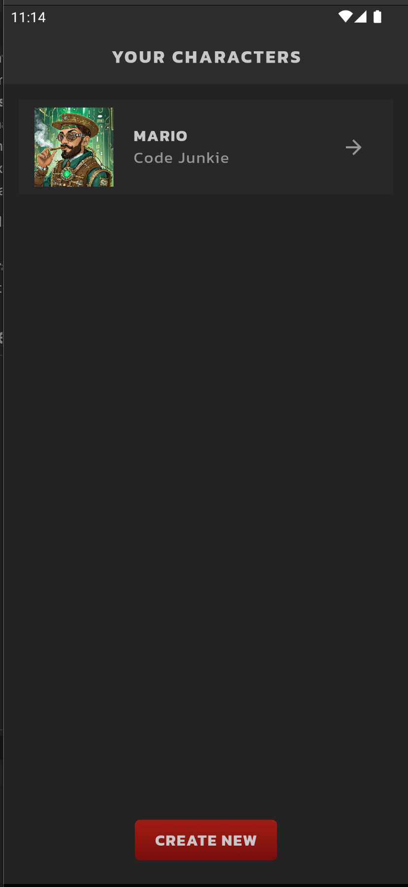
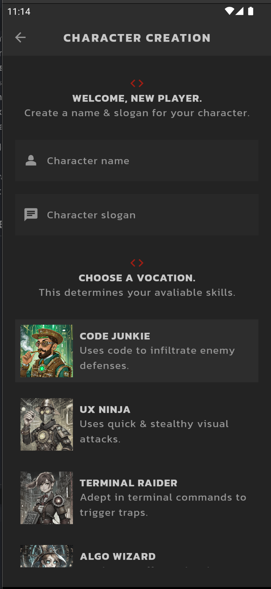
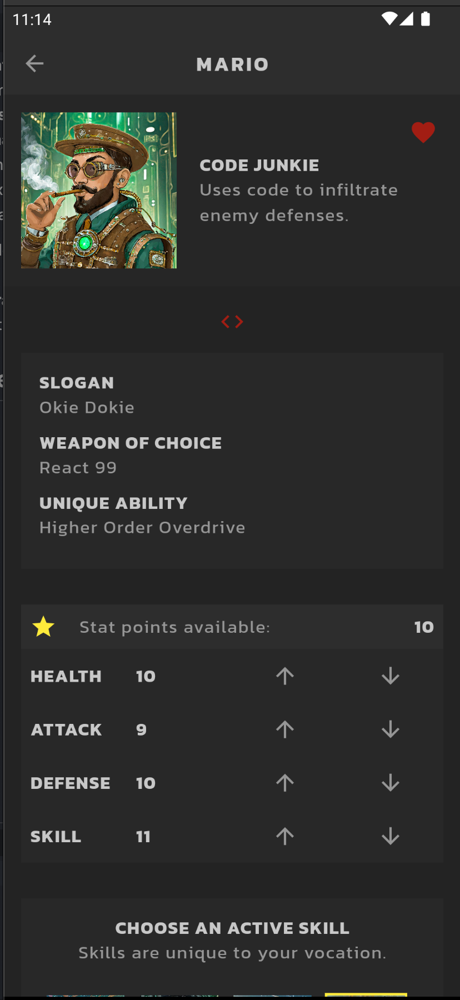

# RPG Character Creator

The **RPG Character Creator** is a mobile application built using Flutter, allowing users to create and manage unique characters for RPG games. The app lets users define their characters' names, slogans, and skills, view key stats, and toggle their favorite status. Firebase integration provides a seamless backend for creating, updating, deleting, and storing character data in real-time.

## Features

- **Character Creation**: Users can create characters with a name, slogan, and choose from a list of available skills.
- **Character Stats**: View stats such as health, strength, agility, and more.
- **CRUD Functionality**: Connected to Firebase, users can:
  - Create a new character.
  - Update existing character details.
  - Delete characters.
- **Favorites Toggle**: Mark characters as favorites and filter them in the character list.
- **Firebase Integration**: All character data is stored and managed using Firebase's real-time database.

## Application Overview

    
    
    

